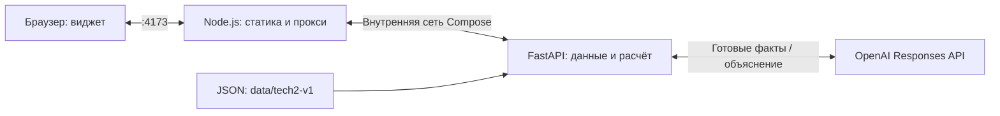

# Архитектура текущего MVP

**Редакция:** 23 сентября 2026 года. Описана реализованная сборка в main. Предыдущий проект со Streamlit и Ollama заменён интерфейсом JavaScript и OpenAI Responses API.

## Компоненты

В Docker Compose работают два контейнера:

| Компонент | Реализация | Назначение |
| --- | --- | --- |
| ui | Node.js 22, HTML, CSS, JavaScript, SVG | Статические файлы виджета и прокси запросов API |
| api | Python 3.12, FastAPI, Uvicorn, Pydantic, OpenAI SDK | Каталог, валидация, расчёт сценария и объяснения |

Исходники интерфейса, Node-сервера и JavaScript-тесты находятся в `frontend/`. Числовое ядро и AI-адаптер находятся в `backend/`, транспортные схемы — в `shared/`. Источник исходных данных и правил — `data/tech2-v1/`.

Compose публикует UI на `127.0.0.1:4173`. В обычном запуске API доступен только внутри сети контейнеров на порту 8000. UI запускается после успешного healthcheck API.

## Данные и пользовательский сценарий

1. `GET /api/v1/catalog` возвращает каталог, правила и исходные показатели.
2. Браузер рассчитывает предпросмотр по каталогу. `POST /api/v1/validate` проверяет текущий набор на сервере.
3. После пяти допустимых решений `POST /api/v1/evaluate` возвращает окончательные показатели, бюджет, дельты, эффекты мер и синергий.
4. Сразу появляется обычный отчёт по городу или району. Вклад мер в интерфейсе разложен по значениям Шепли на основе браузерной модели. Окончательный Score берётся из API.
5. Кнопка «Получить рекомендации ИИ» вызывает `POST /api/v1/explain` для выбранного языка и территории. Ответ кешируется отдельно для сценария, языка и района.

Сервер проверяет бюджет 100, ровно пять разных мер, максимум две меры одного направления, область действия и несовместимости. Сначала суммируются эффекты с лагом и фиксированные синергии, затем значения ограничиваются шкалой 0–100 и рассчитываются районные баллы и городской Score. Невалидный итоговый сценарий не рассчитывается.

## AI

OpenAI получает рассчитанные сервером изменения показателей и вклады выбранных мер после учёта лага. Синергии передаются отдельно; итоговые дельты учитывают ограничение шкалы. Модель формулирует объяснение и рекомендацию, вычисление Score остаётся в Python.

AI запускается только по кнопке. Выбор района или языка сам по себе не вызывает внешний запрос. Ответ — один абзац на русском, казахском или английском, целевой объём 50–75 слов и до 600 символов. При недоступности AI остаётся обычный отчёт с сообщением.

Ключ и модель задаются окружением API: `OPENAI_API_KEY` и `OPENAI_MODEL`. Модель по умолчанию отсутствует. Для `gpt-6-luna` используется `reasoning.effort=none`, максимальный вывод ограничен 900 токенами. Процесс API обслуживает один запрос генерации одновременно; отключение клиента отменяет запрос и освобождает слот.

## Запуск и ограничения

Команды запуска и тестов приведены в [README](README.md). Обычный запуск использует `compose.yaml`; `compose.dev.yaml` подключает исходники и дополнительно публикует API на `127.0.0.1:8000`.

Ключи хранятся в локальном файле окружения, исключённом из Git и Docker-контекста. Статический сервер отдаёт только явно разрешённые публичные файлы. Ключ OpenAI не передаётся браузеру и не включён в UI-образ.

Базы данных и авторизации нет. Сценарий и AI-кеш живут в памяти вкладки и сбрасываются при перезагрузке. Язык сохраняется локально. Сравнение команд, случайные события и экспорт презентаций не реализованы.

## Контракты и проверки

- [HTTP-контракт и серверная модель](docs/BACKEND_CONTRACT.md).
- [Проверки интеграции](docs/INTEGRATION_CHECKS.md).
- JavaScript-тесты проверяют предпросмотр, вклад мер, размещение объектов, локализацию и HTTP-прокси.
- Python-тесты проверяют правила, контрольные расчёты, AI-контекст, локализацию и отмену генерации.
- `tests/parity.mjs` сравнивает браузерную модель с API на 36 сценариях и 3650 значениях показателей.
