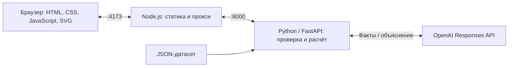

# Аким на 5 часов

AI-симулятор управления Астаной: распределите бюджет **100 условных единиц** между пятью инициативами и получите **Astana Quality of Life Score** с объяснением последствий.

Проект предназначен для городских управленцев, аналитиков и участников симуляции. Он позволяет сравнить, как решения в транспорте, экологии, социальной инфраструктуре, безопасности и городских сервисах влияют на качество жизни. Все начинают с одинаковых синтетических данных.

## Возможности

- Интерактивная карта пяти районов и 14 мероприятий с заданными стоимостью и эффектами.
- Контроль бюджета, количества решений и совместимости мер.
- Предварительный просмотр изменений и итоговый отчёт по городу и районам на горизонте восьми кварталов.
- Краткие AI-рекомендации по запросу для города или выбранного района.
- Интерфейс и объяснения на русском, казахском и английском.

## Запуск

Нужны Git и Docker с Compose. Команды для Bash:

```sh
git clone https://github.com/BAITC-Hacks/hack-518b6a53-bom.git
cd hack-518b6a53-bom
test -f .env.local || cp .env.example .env.local
docker compose --env-file .env.local up -d --build
```

Откройте [http://localhost:4173](http://localhost:4173). Публичной демоверсии пока нет.

Для AI-разбора заполните в `.env.local` **оба** поля: `OPENAI_API_KEY` и `OPENAI_MODEL` — ключ и доступный API ID модели с поддержкой структурированных ответов Responses API. Модель по умолчанию не задана; текущая интеграция проверена с `gpt-6-luna`. После изменения настроек повторите команду запуска. Обычный расчётный отчёт доступен сразу, AI вызывается только кнопкой **«Получить рекомендации ИИ»**. Без конфигурации AI или при ошибке OpenAI приложение сохраняет обычный отчёт и показывает сообщение о недоступности рекомендаций. Ключ не добавляйте в Git.

Остановка:

```sh
docker compose --env-file .env.local down
```

Если приложение не отвечает, проверьте логи:

```sh
docker compose --env-file .env.local logs --tail=100 ui api
```

Остальные параметры окружения описаны в [.env.example](.env.example).

## Пример использования

Выберите карточку мероприятия и нажмите на нужный район либо перетащите её на карту. Городская мера применяется ко всему городу. Соберите такой план:

| ID | Мероприятие | Где | Стоимость |
| --- | --- | --- | ---: |
| M7 | Школа + детсад | Нура | 24 |
| M8 | Центр семейного здоровья | Нура | 20 |
| M10 | Освещение и камеры Safe City | Нура | 12 |
| M12 | Платформа обращений жителей | Весь город | 14 |
| M5 | Чистое топливо для частного сектора | Сарыарка | 25 |

Нажмите **«Рассчитать»**. Стоимость — **95 из 100**, Score меняется с **52,56 до 56,54**. В отчёте доступны показатели и выводы по городу и районам. Нажмите «К карте», чтобы изменить план, или «Новый сценарий», чтобы начать заново.

По умолчанию показывается обычный отчёт с числовыми результатами и шаблонными выводами. Для AI выберите вкладку города или любого района и нажмите **«Получить рекомендации ИИ»**: появится короткий абзац на текущем языке интерфейса. Открытие отчёта, смена района и языка не запускают AI автоматически. Полученный ответ кешируется для текущего сценария, языка и района; к обычному отчёту можно вернуться отдельной кнопкой. Изменение плана сбрасывает эти ответы.

Для проверки поведения:

- Замените M10 на M11 в Нуре: стоимость станет **93**, Score — **56,33**.
- Вместо M10 попробуйте добавить M3: стоимость превысила бы бюджет до **113**, поэтому добавление будет отклонено.
- Удалите одну меру: расчёт недоступен, пока в плане не будет пяти допустимых решений.

## Правила и расчёт

Нужно выбрать ровно пять разных мероприятий, не более двух одного направления, на сумму до 100. **Выбор по одному мероприятию из каждого направления не требуется.** M1 и M3 несовместимы; M4 и M7, а также M5 и M13 нельзя сочетать в одном районе.

У каждого района десять индикаторов от 0 до 100 — больше означает лучше. Эффекты мер учитывают задержку реализации и совместное действие некоторых инициатив. После их применения значения индикаторов ограничиваются диапазоном 0–100.

```text
Эффект меры = эффект из каталога × (8 − задержка в кварталах) / 8
Балл района = сумма значений индикаторов с их весами
Средний балл = сумма баллов районов с весами по доле населения
Score = 0,7 × средний балл + 0,3 × минимальный балл района − N
```

`N` — количество пар «район — индикатор» со значением ниже 40. Формула учитывает средний уровень города, слабейший район и критические показатели. Веса, конфликты и синергии заданы в [rules.json](data/tech2-v1/rules.json).

## Технологии и архитектура



Интерфейс работает без UI-фреймворка и npm-зависимостей. Браузерная модель показывает предварительные изменения; итоговый результат проверяет и рассчитывает Python. OpenAI получает факты отчёта и формирует объяснение. Числа в отчёте определяет расчётная модель.

В Docker используются Node.js 22 и Python 3.12. Backend — FastAPI, Uvicorn, Pydantic v2 и OpenAI SDK; версии закреплены в [requirements/api.lock](requirements/api.lock). Compose публикует только интерфейс на `127.0.0.1:4173`, API доступен внутри сети контейнеров. Ключ OpenAI хранится на стороне API.

API предоставляет каталог, проверку сценария, расчёт и объяснение. Маршруты и форматы запросов описаны в [контракте backend](docs/BACKEND_CONTRACT.md). Ответ объяснения содержит `mode: "llm"` или `mode: "fallback"`.

Структура проекта:

```text
frontend/       HTML, CSS, JavaScript, SVG, package.json, Node-сервер и JS-тесты
backend/        FastAPI, расчётное ядро, валидация и AI-адаптер
shared/         Схемы HTTP-запросов и ответов
data/tech2-v1/  Версионированные исходные данные и правила
docker/         Dockerfile интерфейса и API
docs/           Контракты и документация
tests/          Python-тесты и сверка браузерного расчёта с API
requirements/   Зафиксированные зависимости Python
compose.yaml    Запуск интерфейса и API
```

## Данные и ограничения

Датасет [data/tech2-v1](data/tech2-v1/) содержит пять районов — Есиль, Алматы, Сарыарка, Байконур и Нура, — их показатели, доли населения, мероприятия и правила. Данные синтетические; персональные данные не нужны.

- Результат показывает поведение условной модели и не является проверенным прогнозом развития города.
- Живых городских данных и подключений к городским системам нет. Единственная внешняя интеграция — OpenAI для объяснений.
- Карта схематична и основана на расположении районов 2023 года; текущие юридические границы не воспроизводятся.
- Нет авторизации и сохранения сценариев: перезагрузка страницы сбрасывает план. Сохраняется только язык интерфейса.
- Сравнение команд, случайные события и генерация презентаций не реализованы.

## Разработка и тесты

Запуск с подключёнными исходниками и автоматической перезагрузкой серверов:

```sh
docker compose --env-file .env.local -f compose.yaml -f compose.dev.yaml up -d --build
```

Интерфейс остаётся на порту 4173, API — на порту 8000. Документация Swagger UI доступна на [http://localhost:8000/docs](http://localhost:8000/docs). Для остановки используйте те же Compose-файлы с командой `down`.

Все тесты можно запустить в Docker без Node.js и Python на хосте. Команды из корня проекта используют актуальные исходники; ответы OpenAI подменяются, платных API-вызовов нет:

```sh
docker compose --env-file .env.local build ui api
docker compose --env-file .env.local run --rm --no-deps -v .:/workspace:ro -w /workspace/frontend ui npm test
docker compose --env-file .env.local -f compose.yaml -f compose.dev.yaml run --rm --no-deps -v ./tests:/app/tests:ro api python -m unittest discover -s tests -p test_backend.py -v
```

Проходят **41 JavaScript-тест и 25 Python-тестов**: расчёты и ограничения, переводы, API-контракты, область AI-объяснения, fallback и отмена запроса при отключении клиента.

Для сверки браузерной модели с работающим API сначала выполните обычную команду запуска из раздела «Запуск», затем:

```sh
docker compose --env-file .env.local run --rm --no-deps -v .:/workspace:ro -w /workspace ui node tests/parity.mjs http://ui:4173
```

При установленном Node.js ≥ 22 те же JavaScript-проверки доступны локально через `npm --prefix frontend test`, а сверка с запущенным приложением — через `node tests/parity.mjs` или `npm --prefix frontend run test:parity`. Установка npm-пакетов не требуется.

## Материалы

[ТЗ и критерии оценки](data_2_1.md) — [Данные и правила кейса](data.md) — [Требования к README](docs/README_PROMPT_EXAMPLE.md).

Исходные материалы: [ТЗ в Google Docs](https://docs.google.com/document/d/1Uc-GdGoKhDY-spu8V50-ZMm33t2CjYLP/preview) и [датасет в Google Docs](https://docs.google.com/document/d/1oDZtYnBgbcn_Ii7vleP87hkARJ2HmbXl7Cw_rsCxqpo/preview).

Геометрия в [frontend/map-geometry.js](frontend/map-geometry.js) адаптирована по [Astana districts coloured 2023.png](https://commons.wikimedia.org/wiki/File:Astana_districts_coloured_2023.png), автор **Bogomolov.PL**, лицензия [CC BY-SA 4.0](https://creativecommons.org/licenses/by-sa/4.0/). Уведомление относится только к геометрии карты.
